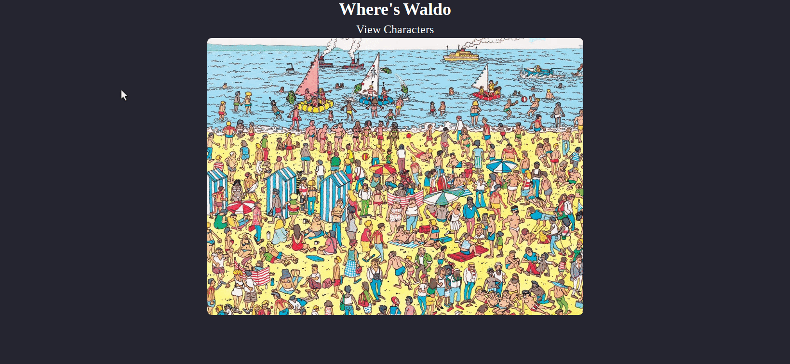

<div align="center">
        
   # Where's Waldo
        
   Photo Tagging Application inspired by Where's Wally.
        
   [Live Demo](https://photo-tagging-app-27499.firebaseapp.com/) •
   [Installation](#installation) •
   [Technologies](#technologies)
  [](https://github.com/LeoKirasic/photo-tagging-app)

</div>

<div align="left">
        
# Installation
        
```
git clone https://github.com/LeoKirasic/photo-tagging-app.git
cd photo-tagging-app
npm install
npm run build
firebase deploy
```
</div>


<div align="left">
        
# Technologies
- [Typescript](https://www.typescriptlang.org/)
- [React](https://github.com/facebook/react)
- [React Router](https://github.com/remix-run/react-router)
- [TailwindCSS](https://github.com/tailwindlabs/tailwindcss)
- [React Testing Library](https://testing-library.com/docs/react-testing-library/intro/)
- [Jest](https://jestjs.io/)
- [Firebase](https://firebase.google.com/)
- [uniqid](https://www.npmjs.com/package/uniqid)
- [Create React App](https://github.com/facebook/create-react-app/)

</div>

<div align="left">
 
# Reflections
        
TBD
        
</div>
